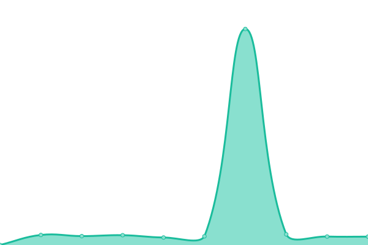

# [📈 Live Status](https://navaneethkm004.github.io/uptime): <!--live status--> **🟧 Partial outage**

This repository contains the open-source uptime monitor and status page for [Navaneeth K M](https://navaneethkm004.github.io/uptime), powered by [Upptime](https://github.com/upptime/upptime).

With [Upptime](https://upptime.js.org), you can get your own unlimited and free uptime monitor and status page, powered entirely by a GitHub repository. We use [Issues](https://github.com/navaneethkm004/uptime/issues) as incident reports, [Actions](https://github.com/navaneethkm004/uptime/actions) as uptime monitors, and [Pages](https://navaneethkm004.github.io/uptime) for the status page.

<!--start: status pages-->
<!-- This summary is generated by Upptime (https://github.com/upptime/upptime) -->
<!-- Do not edit this manually, your changes will be overwritten -->
<!-- prettier-ignore -->
| URL | Status | History | Response Time | Uptime |
| --- | ------ | ------- | ------------- | ------ |
|  [Stark AI](https://starkai.live) | 🟩 Up | [stark-ai.yml](https://github.com/starkaistatus/Uptime/commits/HEAD/history/stark-ai.yml) | 

 311ms
     
 | 

<a href="https://status.starkai.live/history/stark-ai">99.73%</a>
    

|  [Stark AI Beta](https://beta.starkai.live) | 🟩 Up | [stark-ai-beta.yml](https://github.com/starkaistatus/Uptime/commits/HEAD/history/stark-ai-beta.yml) | 

 423ms
     
 | 

<a href="https://status.starkai.live/history/stark-ai-beta">100.00%</a>
    

|  [API Endpoint](https://starkai.live/sydeny/chat/message/hi) | 🟥 Down | [api-endpoint.yml](https://github.com/starkaistatus/Uptime/commits/HEAD/history/api-endpoint.yml) | 

 288ms
     
 | 

<a href="https://status.starkai.live/history/api-endpoint">0.00%</a>
    

<!--end: status pages-->

[**Visit our status website →**](https://navaneethkm004.github.io/uptime)

## 📄 License

- Powered by: [Upptime](https://github.com/upptime/upptime)
- Code: [MIT](./LICENSE) © [Navaneeth K M](https://navaneethkm004.github.io/uptime)
- Data in the `./history` directory: [Open Database License](https://opendatacommons.org/licenses/odbl/1-0/)
